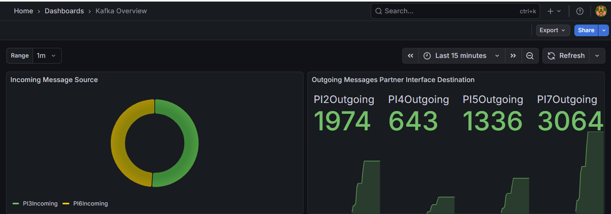
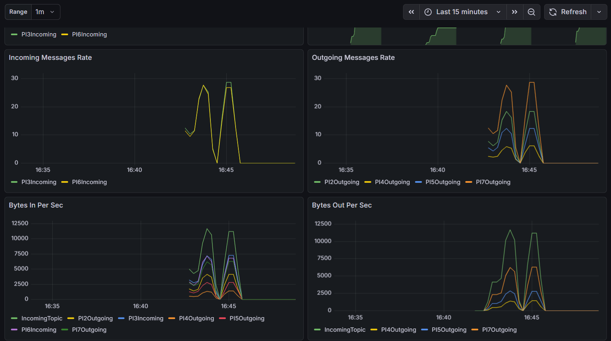
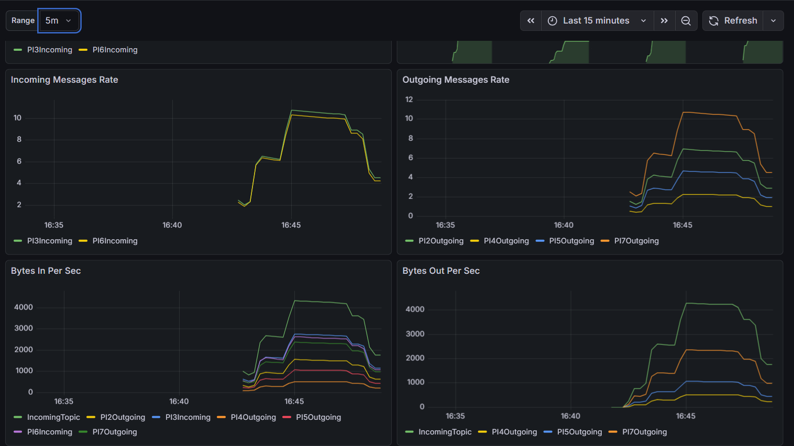
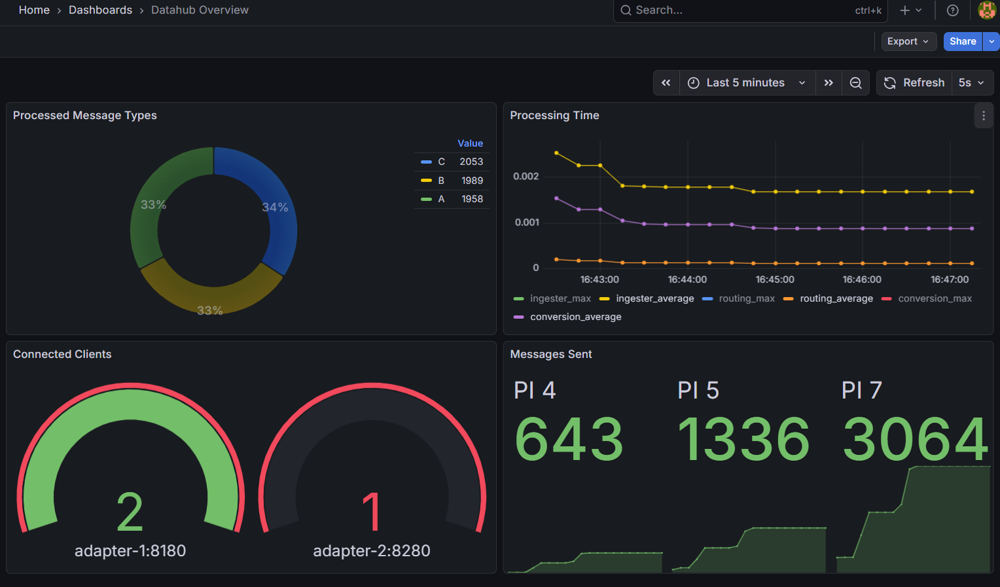
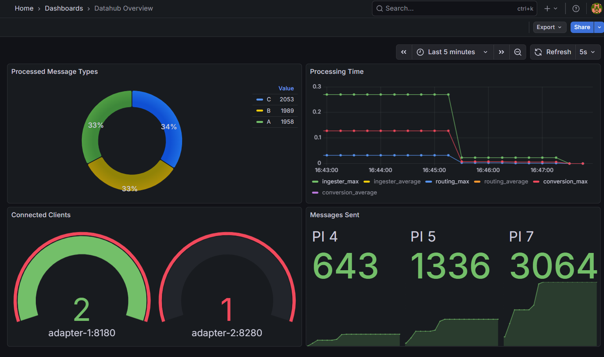

# Datahub POC - Monitoring

# Stack
	JMX Exporter - Kafka
	Spring Actuator and Micrometer Prometheus - Spring Boot Applications
	Prometheus
	Grafana
	
## Configuration
**JMX Exporter - Kafka** - uses jmx_prometheus_javaagent, a collector to capture JMX MBean values and exposes it to port 9404. 
- **Docker/jmx_exporter/kafka-jmx-config.yml** contains the metrics exported

**Spring Actuator** - provides a series of built-in endpoints to display performance information about the running application, such as health, and metrics 
**Micrometer Prometheus** - provides registry to record metrics and formats it to Prometheus-readable

-	**Custom Metrics**
	- ingester.message.incoming.count - number of messages received
	- ingester.time - recorded time from receiving the message from RestAPI endpoint to response
	- datahub.routing.time - recorded time for selecting the routes for the message
	- datahub.conversion.time - recorded time for converting the message to outgoing format
	- adapter.message.sent.count - number of messages sent to the consumer partner via TCP
	- adapter.connected.clients - number of parnters with active TCP connections  

**Prometheus** - monitoring tool that collects real-time metrics data

-	**Docker/prometheus.yml** contains sources scrape configuration
	- Note: If Datahub and Adapter is run on local machine, target host may need to be updated to properly extract metrics
 

**Grafana** - dashboard tool that takes data from prometheus and shows it in the form of charts and dashboards

-   **grafana/datasources/datasource.yml** contains datasource configuration
- **grafana/provisioning/dashboards** contains dashboard configuration and is loaded on start-up
- **admin login** allows creation and editing of datasources and dashboards
	- username: admin
	- passworkd: admin 

## Grafana Dashboards

### Kafka Overview
Contains visualization of metrics retrieved from broker

#### Panels

- *Incoming Message Source* - shows the number of messages per incoming topic
- *Outgoing Messages Partner Interface Destination* - shows the number of messages per outgoing topic
- **Incoming Messages Rate* - average number of messages sent to incoming topics over set range 
- *Outgoing Messages Rate* - average number of messages sent to outgoing topics over set range 
- *Bytes In Per Sec* - number of bytes received per topic from producer over set range
- *Bytes Out Per Sec* - number of bytes sent per topic to consumers over set range 

	Changing the range disperses the distribution over the interval (shown above is 1m, below is 5m)

### Datahub Overview
Contains visualization of metrics retrieved from datahub-app and adapter-app

#### Panels

- *Processed Message Types* - shows the number of messages received per message type
- *Processing Time* - shows the duration of each processing step. (*_average - sum of processing time/number processed, *_max - maximum time process completed) 
- *Connected Clients* - shows number of clients connected on each adapter
- *Messages Sent* - shows number of actual messages sent to partner TCP connection per partner interface id