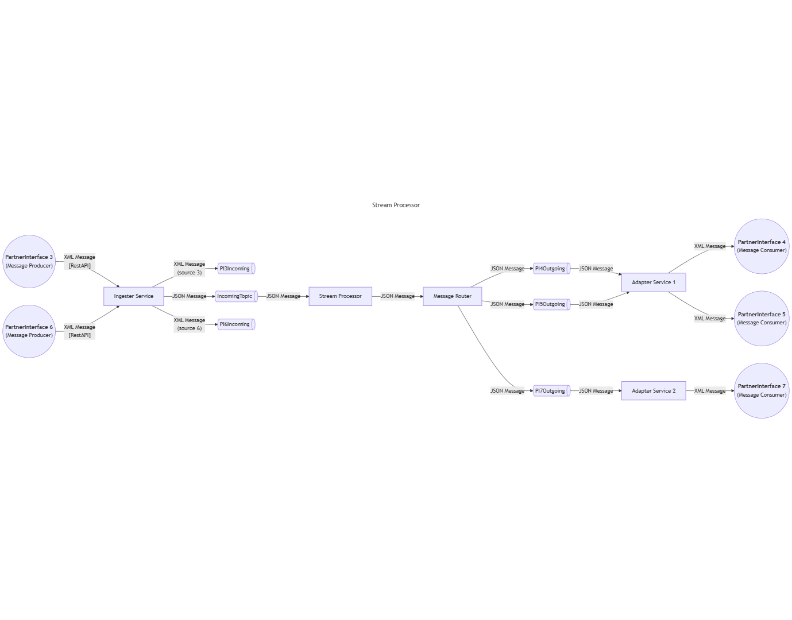

# Datahub POC

# Pre-requisites
### Operation:
	Docker
	Python
	
### Development:
	Java 21
	Maven
	IDE (Optional)

## Contents
**Adapter** 	-  contains the source code for the Adapter SpringBoot application
**DatahubPOC** 	-  contains the source code for the Datahub SpringBoot application
**PartnerSimulator**  -  contains the source code for the python scripts of the partner simulators 
**Docker/compose_yaml**  -  docker compose yaml file to setup all dependency containers
**data** 	-  contains json configuration for setting up partners, interfaces, and routing criteria.
**grafana** - contains the grafana provisioning files to setup datasource and dashboard

## Installation Setup
Clone this repository or download the repository as zip and extract all in a folder.

### Kafka 
Go to Docker path and execute the command to setup kafka components

	"docker-compose -f .\docker-kafka.yml up -d"
	
Confirm all services are running

- **broker** - exposed to host using port 9092
- **kakfa-ui** - exposed to host using port 18080

### DatahubPOC and Adapter
Go to Docker path and execute the command to setup Datahub and Adapter applications as containers

	"docker-compose -f .\docker-datahub.yml up -d"
Confirm all services are running
-   **datahub-app**  - exposed to host using port 8080
-   **adapter-1** - exposed to host using port 9293
-   **adapter-2** - exposed to host using port 9294

***OR***
Go to DatahubPOC path and execute the command to start the SpringBoot application for Datahub

	"./mvnw spring-boot:run"
Go to Adapter path and execute the command to start the SpringBoot application for Adapter

	"./mvnw spring-boot:run"

### Partner Simulators
Go to PartnerSimulator path and execute the command to start the simulators
- **Producer**

		"producer.py [messageCount] [messageType] [destination]"
	
	- *messageCount* (optional, default = 1) - determines the number of XML messages that will be created
	- *messageType* (optional, default = -) - determines the message type to be set on the message header. If - is provided as value it will randomly pick from values: A,B,C
	- *destination* (optional) - determines the message type to be set on the message header. If 0 is provided as value it will randomly pick from values: 1,2,3, otherwise it will not be set in the header.

- **Consumer**

		"producer.py [partnerId] [port] [messageCount]"
	- *partnerId* (optional, default = 0) - used to set identify the partner when signing-on to the adapter
	 - *port* (optional, default = 9293) - determines the port on which the partner will connect to using localhost
	 - *messageCount* (optional, default = 0) - determines how many messages are expected to be received before the simulator terminates. If 0 is set, it will continue to read.

## Components

### Kafka
distributed platform for real-time data streaming and message processing
- **broker** - instance of kafka broker which is responsible of storing and managing messages through topics and serves data between  producers and consumers of event messages
- **kakfa-ui** - web UI to manage kafka topics, messages, and brokers.

### DatahubPOC
Springboot application that contains 
- **Ingester** service that exposes a RestAPI endpoint where messages can be sent to. Messages received will then be sent to **IncomingTopic** (all messages) and incoming topics (e.g. **PI3Incoming** or **PI6Incoming**) based on *source*

- **StreamProcessor** will then consume all messages in IncomingTopic, and route it to corresponding outgoing topics; (e.g. **PI4Outgoing** and **PI5Outgoing**).

Parameters are loaded from data 
- partners.json - contains all primary partner data
-  partnerInterfaces.json - contains data for configuration of partner interfaces. Each entry will generate a topic
- routingCriteria.json - contains routing parameters to determine which outgoing topics will receive which message

### Adapter
Springboot application that creates the server to which partner consumer can connect to. It contains a kafka listener that reads messages from outgoing topics (e.g. **PI4Outgoing** and **PI5Outgoing**), and transforms the messages into XML format, and sends it to the connected consumer partner.

### Partner Simulators

 - **producer.py** - generates XML messages based on template provided (template/default.xml) and puts random value on the following
   
    -   source (values: 3,6) to determine to which incoming topic it will be sent at initial ingestion,
    -   messageType (values: A,B,C) - criteria for routing
    -   destination (values: 1,2,3) - criteria for routing
    -   body (index|timestamp) for metrics. XML messages are sent to DatahubPOC via RestAPI endpoint ([http://localhost:8080/datahub/](http://localhost:8080/datahub/))
	
- **consumer.py** - connects and signs-on to **Adapter** using *partnerId*, then consumes *messageCount* XML messages read from outgoing topics, displays the calculated elapsed time from which the message is generated by the producer up until it was received by this consumer. After all messages received it will display calculated messages per second.

## Message Flow
